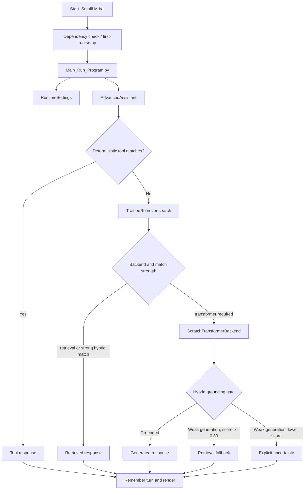

# Architecture

## System overview

SmallLM is a local hybrid assistant. It combines deterministic tools, a trained
TF-IDF retriever, and a decoder-only transformer trained from random
initialization. Rich provides the terminal presentation layer but does not
provide model intelligence.

## Startup sequence

1. `Start_SmallLM.bat` changes to the repository directory.
2. It checks for `.venv\Scripts\python.exe` and imports every runtime package.
3. If Python or a dependency is missing, it verifies that `uv` is available and
   invokes `setup.ps1`.
4. `setup.ps1` creates a Python 3.11 virtual environment when necessary and
   installs the exact versions in `requirements.txt`.
5. The batch launcher starts `Main_Run_Program.py` with the project interpreter.
6. The Python UI initializes in-memory defaults. No setting is persisted.
7. The retrieval model is loaded when chat starts. The transformer checkpoint
   is loaded lazily only when response routing needs generation.

`Main_Run_Program.py` can relaunch itself through the project environment when
opened with another Windows Python, but that is a convenience fallback. The
supported public entry point is the batch launcher.

## Module ownership

| Path | Responsibility |
| --- | --- |
| `Start_SmallLM.bat` | public launch, dependency health check, first-run setup |
| `setup.ps1` | create `.venv` and install runtime dependencies |
| `Main_Run_Program.py` | home screen, settings, chat commands, animation, streaming, model info |
| `main.py` | internal maintenance CLI and script orchestration |
| `smalllm/config.py` | canonical artifact paths, system prompt, history default, special tokens |
| `smalllm/assistant.py` | tools/retrieval/transformer routing, grounding, memory |
| `smalllm/backend.py` | tokenizer wrapper, transformer definition, checkpoint I/O, generation |
| `smalllm/retrieval.py` | corpus validation, canonical hashing, TF-IDF training and search |
| `smalllm/tools.py` | deterministic intent handlers executed before model routing |
| `scripts/prepare_dataset.py` | download, filter, deduplicate, and write corpora |
| `scripts/build_index.py` | build the retrieval artifact |
| `scripts/train_transformer.py` | train tokenizer and transformer, save best checkpoint and report |
| `scripts/evaluate.py` | broad qualitative smoke evaluation and JSON report |
| `test_main.py` | regression, integrity, behavior, and storage tests |

## Response-routing contract

`AdvancedAssistant.respond()` is the central behavior contract:

1. Whitespace is stripped. An empty prompt returns a validation response.
2. `run_tool()` tries deterministic handlers in a fixed order.
3. If no tool matches, the retriever returns `retrieval_limit` candidates.
4. A match is strong when the first score is at least
   `direct_retrieval_threshold` (default `0.50`).
5. The `retrieval` backend always returns the first retrieved answer.
6. The `hybrid` backend returns a strong retrieved answer directly.
7. Otherwise the transformer receives the system prompt and recent history.
8. In `hybrid` mode, a disconnected/repetitive generation falls back to the
   first retrieved answer when its score is at least `0.30`; otherwise the user
   receives an explicit uncertainty message.
9. The raw `transformer` backend does not apply the hybrid fallback decision.
10. Every successful tool, retrieval, or model response is appended to history.

Changing the order above is a product behavior change. Add focused routing tests
before altering it.

## Conversation state

History is a list of `{role, content}` dictionaries stored on one
`AdvancedAssistant` instance. Each turn adds two messages. The limit is a count
of messages, not turns. The default of 8 therefore represents up to four full
user/assistant turns.

Opening `/settings` rebuilds the assistant with the new configuration, then
copies the newest messages up to the new history limit. `/clear` empties history.
Returning home and starting a new chat creates a new assistant and new history.

## Public versus internal boundaries

The root README documents only `Start_SmallLM.bat` and in-chat controls. Keep
`main.py` and the scripts usable for maintenance, testing, data preparation, and
training, but do not reintroduce them as public end-user workflows unless that
product decision is explicitly reversed.
